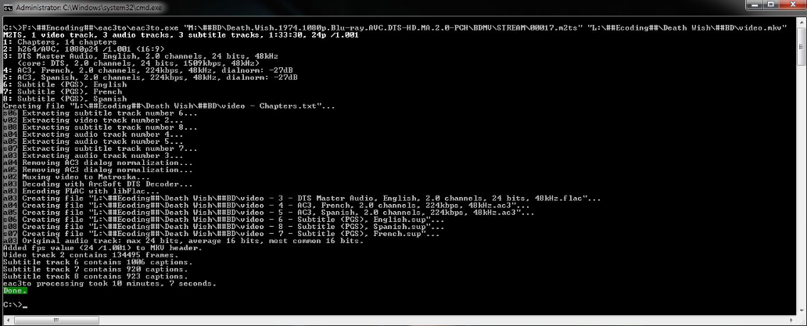

# 高清编码指南 中文版

# 所需环境

- 多核处理器(最好是支持[AVX2](https://en.wikipedia.org/wiki/Advanced_Vector_Extensions#Advanced_Vector_Extensions_2)指令集，2015年之后发布的x86 CPU基本都支持)
- 约 100 GB 的空闲硬盘空间
- Windows 64 位操作系统
- Microsoft Visual C 2010 Redistributable Package 的 x86 和 x64 版本
- .NET Framework 3.5 或更新版本（Windows 7 已内含）
- Python：虽然大多数脚本对python版本没严格要求，只要是python3即可，但最好是满足VapourSynth要求的版本号

# 所需软件

下面以及文中出现的各类软件，如果是绿色软件，最好统一放在一个路径中没有中文的文件夹内分类保存，AviSynth、VapourSynth等平台工具安装在系统盘程序文件夹内，运行库(.dll)、脚本、滤镜等放在平台工具指定的文件夹内。

- [BDinfo](https://www.free-codecs.com/download/bdinfo.htm)：用于查看蓝光原盘基本信息

- [TsMuxer](https://github.com/justdan96/tsMuxer)：用于原盘音视频的解流

- [VapourSynth](https://github.com/vapoursynth/vapoursynth/releases) : AviSynth最有力的后继者。

- [LSmashSource](https://github.com/AkarinVS/L-SMASH-Works/releases) ：目前最主流的源滤镜，按说明把文件放进VapourSynth的指定插件目录即可。

- [VapourSynth Editor](https://github.com/YomikoR/VapourSynth-Editor/releases/) ：VapourSynth编辑器，也可以用[VapourSynth Preview](https://github.com/Irrational-Encoding-Wizardry/vs-preview/releases)

- [x264](http://x264.nl/)：下载其最新的 32 位及 64 位版本。解压 64 位的压缩包并将 x264.exe 重命名为 x264_x64.exe。2016年之后x264项目已经很少有改动，可以下载mod版，[这里](https://down.7086.in/x264_Yuuki/)是动漫组常用的Yuuki版，[这里](https://github.com/jpsdr/x264/releases)是国外组常用的tmodNew，过去流行的[tmod版](https://www.nmm-hd.org/newbbs/viewtopic.php?f=8&t=219)由于作者过于现充已经停更……

- [MKVToolNix](https://mkvtoolnix.download/index.html)：用于最后混流mkv成品。

  *以下软件不会在正文中使用，但大多可能会出现在其他同类教程内，有提到时可以参考下载*

- [eac3to](https://forum.doom9.org/showthread.php?t=125966)：为 eac3to 制作的图形界面有好几个，我建议不要使用它们——坚持命令行好榜样。相关 [wiki](https://en.wikibooks.org/wiki/Eac3to/How_to_Use) 在此。

- [dtsdecoderdll.dll](https://www.mediafire.com/?196ict44mc4hk7h)：解压并移入 eac3to 的安装目录。

- [DTS-HD Master Audio Suite](https://www.mediafire.com/?an8aj6a1y675mox)：下载并将文件扩展名重命名为 .zip 然后将内容解压到某处。

- [AviSynth](https://sourceforge.net/projects/avisynth2/files/AviSynth 2.5/)：所有的 32 位 AviSynth 插件都应放入 %programfiles%\AviSynth\plugins 文件夹。

- [64-bit AviSynth](https://code.google.com/p/avisynth64/) 及任何必须的 [插件](https://code.google.com/p/avisynth64/wiki/PluginLinks)：它们仅会用于去隔行、detelecining (IVTC) 或是部分视频的清洁。

- [AvsPmod](http://www.videohelp.com/tools/AvsP)：用于编写AVS脚本

- [ffmpegsource](https://github.com/FFMS/ffms2)：解压对应的ffms2.dll 和 FFMS2.avsi 并移入 AviSynth和VapourSynth要求的插件文件夹。

- [TIVTC](https://github.com/pinterf/TIVTC)：只有电视转播源需要它，解压 TIVTC.dll并移入 %programfiles%\AviSynth\plugins。

- [AnyDVD HD](https://www.mediafire.com/?ppvtdjj95l7bqk9)：到目前为止，这是将蓝光／HD-DVD 碟复制到你硬盘中的推荐软件。在教程中我没有提到任何关于它使用方法的内容，因为我觉得这玩意儿太简单以至于任何人都能自学成才。下载文件，然后重命名文件扩展名为 .zip，然后将其中的内容解压到某处。

*附录：命令行的使用方法*

*如果你已经会使用cmd、批处理、powershell等工具，那么可以跳过本章节了。*

*首先随便打开一个文件夹，在上方的查看选项卡里将[文件扩展名]与[隐藏的项目]勾选，视频压制过程中经常需要查看确切的扩展名，所以必须勾上。在文件夹地址栏输入cmd回车，即可在现在的地址进入命令行。比如，在存放x264.exe的文件夹进入命令行，输入x264 --fullhelp即可看到x264的详细帮助文档。为了方便代码复用，就需要使用.bat批处理文件了，依然在x264.exe所在文件夹内，新建一个文本文档，在里面输入*

```bash
x264 --fullhelp
PAUSE
```

*选另存为，在最下方编码选择ANSI，另存为x264help.bat，双击这个文件，即可实现与cmd输入命令相同的效果。如果需要在其他位置使用exe，前面加上地址即可`"D:\encode tools\x264.exe" --fullhelp` ，注意命令行、批处理(包括下面的py、vpy文件)里的地址是不能直接包含空格的，遇到含有空格与特殊字符的地址务必用双引号括起来。*

# 步骤详解

## 1. 准备视频源

在开始工作之前，你需要在硬盘中准备好你用于编码的源文件，无论是自己抓取还是从网上下载。抓取原盘的方法请自行搜索学习，这里只讨论更普遍的下载得到的原盘。一般来说抓取与混流重封装的人会采用两种封装方式——ISO与文件夹，将ISO用虚拟光驱挂载后就跟文件夹区别不大了，需要注意的是虚拟光驱的文件夹通常是不可写入其他文件的，下面的部分操作对于ISO而言需要将输出放到其它文件夹操作，以免由于写入权限问题报错失败。

打开BDinfo，如果是文件夹封装或是挂载完毕的ISO，按Browse选中文件夹即可开始扫描，很快扫描完毕，可以获取蓝光盘的一些基本信息：


图中示意的就是一个简单的蓝光原盘结构，00000.mpls作为最长的播放列表，显然对应的就是电影本体，下方Stream File里只有一个00000.m2ts，就是电影的主文件了，以下所有操作都是针对这一个.m2ts文件。有少量蓝光原盘为了反盗版等目的，可能会使用很多个mpls或者几百个m2ts分段，后者俗称肉酱盘，需要压制者耐心寻找正确的影片文件顺序并提取出来。


典型的肉酱盘BDinfo，请务必仔细对照，寻找出正确的播放列表。


## 2. 用tsmuxer解流

打开*tsmuxergui*，将此前确定的m2ts主文件拖进来，如图


能看到视频(H.264)、音频(DTS-HD和AC3)、字幕(PGS)的基本信息列出，把需要的内容选中，再选择输出-Demux 就能获取需要的轨道内容了。下文主要用LSmashWorks作为视频源滤镜，所以可以直接用m2ts作为视频输入，这里只需要解流出音频与字幕，音频选中之后可以选择降频转换DTS-HD为DTS，将3000多kbps的7.1声道次时代音轨降级为1509Kbps的5.1声道DTS音轨。如果是TrueHD音轨，可以用类似方式提取出AC3 Core。(如果需要用下文 **3.音轨压缩**  中的音频压缩方法，这里不需要对7.1与5.1音轨选择降频转换)

***附录内容**——如果你必须用ffms2之类的对ts有输入BUG的源滤镜，可以按下文是用eac3to解流视频内容。*

*前往 eac3to 的安装文件夹，并在其中启动一个命令提示符。如果你只打算使用最优质的音频流（DTS-MA、TrueHD、LPCM），就使用如下命令：`eac3to source.m2ts demuxed.mkv`*

*举个例子，下面是使用上述方法完成解流的截图：*



*如果你的视频源带有 DTS-MA 音频流，且你需要从中提取约 1.5 MB/s 的 DTS 内核，就使用如下命令：*
*`eac3to source.m2ts -demux`*

*然后，找到你的 DTS-MA 音频文件，然后再次使用 eac3to 从 .dtsma 流中提取内核 .dts 文件。*
*`eac3to input.dtsma output.dts -core`*


## 3. 音轨压缩

解流的音轨如果是2.0声道的LPCM或DTS-HD，用flac转换工具转为flac，我习惯用Foobar2000里的转换器，级别选择Level 8即可。如果是音轨更多的DTSHDMA，请继续往下看；如果是评论音轨，请直接跳到本章最后一段。

蓝光源中常见的音轨是7.1/5.1声道的DTSHDMA(DTS-HD MASTER AUDIO)格式，码率高达3.5M-10M，即使是提取的DTS Core 5.1声道音轨也高达1509Kbps，但是作为技术基础的DTS(Digital Theater System)却是一种源自胶片时代的音轨技术(参阅[电影胶片是如何存储声音信息的](https://www.zhihu.com/question/27208270))，压缩率相当难看，甚至不如MPEG1时代开发的mp3格式(1995年)，唯一的优势就是借助胶片时代的专利积累影响了DVD与BluRay的音频规范制定，带来了几乎全方位的硬件支持——没错，大部分压制组之所以保留老旧的DTS音轨，主要就是为了兼容性。

好在随着流媒体的兴盛，压缩率更高的DDP(Dolby Digital Plus)格式总算有了不错的硬件兼容性，虽然基于AC3的压缩率还是不如AAC，但终究有了不错的多音轨新选择。下面介绍的就是基于deew(Dolby Encoding Engine Wrapper)的DDP5.1音频压制方法。

虽然deew是个开源软件，但本质上就是在调用Dolby公司的Dolby Media Encoder执行编码任务。

接着在Github上下载最新版 [Releases · pcroland/deew · GitHub](https://github.com/pcroland/deew/releases) 注意deew.exe务必放在路径里没有中文和空格的位置。

打开cmd，在对应路径输入`deew`回车，即可看到使用说明(与x264/x265一样，双击文件是不会得到任何反馈的)

```bash
D:\ProgramData\deew>deew
deew 2.9.2

USAGE: deew [-h] [-v] [-i [INPUT ...]] [-ti INDEX] [-o DIRECTORY] [-f FORMAT]
            [-b BITRATE] [-dm CHANNELS] [-d DELAY] [-r DRC] [-dn DIALNORM]
            [-in INSTANCES] [-k] [-mo] [-fs] [-fb] [-lb] [-la] [-np] [-pl] [-cl]
            [-c] [-gc]

FLAGS:
  -h, --help                  show this help message.
  -v, --version               show version.
  -i, --input [INPUT ...]     audio file(s) or folder(s)
  -ti, --track-index INDEX    default: 0
                              select audio track index of input(s)
  -o, --output DIRECTORY      default: current directory
                              specifies output directory
  -f, --format FORMAT         options: dd / ddp / thd
                              default: ddp
  -b, --bitrate BITRATE       options: run -lb/--list-bitrates
                              default: run -c/--config
  -dm, --downmix CHANNELS     options: 1 / 2 / 6
                              specifies downmix, only works for DD/DDP
                              DD will be automatically downmixed to 5.1 in case of a 7.1 source
  -d, --delay DELAY           examples: -5.1ms, +1,52s, -24@pal, +10@24000/1001
                              default: 0ms or parsed from filename
                              specifies delay as ms, s or frame@FPS
                              FPS can be a number, division or ntsc / pal
                              you have to specify negative values as -d=-0ms
  -r, --drc DRC               options: film_light / film_standard / music_light / music_standard / speech
                              default: music_light (this is the closest to the missing none preset)
                              specifies drc profile
  -dn, --dialnorm DIALNORM    options: between -31 and 0 (in case of 0 DEE's measurement will be used)
                              default: 0
                              applied dialnorm value between
  -in, --instances INSTANCES  examples: 1, 4, 50%
                              default: 50%
                              specifies how many encodes can run at the same time
                              50% means 4 on a cpu with 8 threads
                              one DEE can use 2 threads so 50% can utilize all threads
                              (this option overrides the config's number)
  -k, --keeptemp              keep temp files
  -mo, --measure-only         kills DEE when the dialnorm gets written to the progress bar
                              this option overrides format with ddp
  -fs, --force-standard       force standard profile for 7.1 DDP encoding (384-1024 kbps)
  -fb, --force-bluray         force bluray profile for 7.1 DDP encoding (768-1664 kbps)
  -lb, --list-bitrates        list bitrates that DEE can do for DD and DDP encoding
  -la, --long-argument        print ffmpeg and DEE arguments for each input
  -np, --no-prompt            disables prompt
  -pl, --print-logos          show all logo variants you can set in the config
  -cl, --changelog            show changelog
  -c, --config                show config and config location(s)
  -gc, --generate-config      generate a new config
                               

D:\ProgramData\deew>deew -gc
Please choose config's location:
1: C:\Users\username\AppData\Local\deew\config.toml
2: D:\ProgramData\deew\config.toml
Location [1/2]: 2
.
.
.
The above config has been created at:
D:\ProgramData\deew\config.toml
```

按说明，输入`deew -gc`生成新的config文件，选择存放位置，然后用文本编辑器打开生成的`config.toml` 我们只需要修改这三行即可

```shell
ffmpeg_path = 'ffmpeg'
ffprobe_path = 'ffprobe'
dee_path = 'D:\ProgramData\Dolby Media Encoder\resources\dee\dee.exe'
```

需要ffmpeg和ffprobe 在https://www.gyan.dev/ffmpeg/builds/ffmpeg-release-full.7z 下载最新版并解压到deew所在文件夹，如果已经有了，就指定好位置即可。Dolby Media Encoder购买或破解后，按上面的地址找到dee.exe填入即可。

命令很简单，默认参数就是用来压缩5.1/7.1声道音轨的 `deew.exe -i ...\input.dts` 

输出内容如下，显示的信息很丰富，会先把DTSHDMA解码暂存在temp文件夹内，再编码为DDP，所以注意磁盘剩余空间不要太小。

```bash
...\deew.exe -i "...\00931.track_4352_fin.dts"
 ▄▄▄▄▄  ▄▄▄▄▄ ▄▄▄▄▄ ▄▄  ▄▄  ▄▄
 ██  ██ ██▄▄  ██▄▄  ██  ██  ██
 ██  ██ ██    ██    ██  ██  ██
 ▀▀▀▀▀  ▀▀▀▀▀ ▀▀▀▀▀  ▀▀▀▀▀▀▀▀
 Dolby Encoding Engine Wrapper

                 Encoding summary
┌─────────────────┬──────────────────────────────┐
│ Version         │ 2.9.2                        │
│ Latest          │ 2.9.3 !!!                    │
├─────────────────┼──────────────────────────────┤
│ DEE version     │ 5.2.0-master                 │
│ ffmpeg version  │ 5.1.1-essentials_...         │
│ ffprobe version │ 5.1.1-essentials_...         │
├─────────────────┼──────────────────────────────┤
│ Input           │                              │
│ Channels        │ 5.1                          │
│ Bit depth       │ 24                           │
├─────────────────┼──────────────────────────────┤
│ Output          │                              │
│ Format          │ DDP                          │
│ Channels        │ 5.1                          │
│ Bitrate         │ 1024 kbps                    │
│ Dialnorm        │ auto (0)                     │
├─────────────────┼──────────────────────────────┤
│ Other           │                              │
│ Files           │ 1                            │
│ Max instances   │ 6                            │
│ Delay           │ 0 ms or parsed from filename │
│ Temp path       │ D:\ProgramData\deew\temp     │
└─────────────────┴──────────────────────────────┘

Running the following commands:
ffmpeg -y -drc_scale 0 -i [input] -map 0:a:0 -c pcm_s24le -rf64 always [output] && dee -x [input]

[ DEE: encode | 00931.track_4352_... (-31 dB) ] ---------------- ----------------------- 40.70%
```

生成后的文件封装后注意检查同步与时长。本方案压缩后可以在1024Kbps码率下获得不弱于DTS 1509Kbps的效果。5.1或7.1声道的TrueHD音轨与无损LPCM音轨也可以采用同样的方法压缩，如果遇到tsmuxer或eac3to无法解流或解流后的文件无法喂给deew的情况，可以直接把m2ts拖进mkvtoolnix里只选需要的音轨(TrueHD音轨只选择thd，不需要ac3 core)，提取为mka文件即可正常使用deew处理了。对于7.1声道音轨 ，会压缩为1536kbps，如果需要压缩为5.1声道1024kbps，需要添加参数`-dm 6`。

**评论音轨**通常会对主视频消音，只有评论者的语音内容，此类人声音频其实不需要太高的码率，可以降低一些来节约码率

用以下命令即可将原盘提取出来的Source.ac3转换为192kbps的音轨
`"...\eac3to.exe"  Source.ac3 Commentary.ac3 -192`

或者用qaac之类的工具转为aac也可，压缩率更高，不过可能在某些老旧设备上播放困难。

*总结一下推荐的音频码率表：*

| 轨道类型 |       源类型        |      720p压制      |     1080p压制      |
| :------: | :-----------------: | :----------------: | :----------------: |
|  主音轨  | 5.1/7.1声道无损音轨 |     1024k DDP      |   1024~1536k DDP   |
|  主音轨  | 2.0/1.0声道无损音轨 | 16bit FLAC/AAC/AC3 |     16bit FLAC     |
|  主音轨  |    其它有损音轨     |       不压缩       |       不压缩       |
|  副音轨  |      无损音轨       |   AAC/AC3 ~192k    | 16bit FLAC/AAC/AC3 |
|  副音轨  |      有损音轨       |   AAC/AC3 ~192k    |   AAC/AC3 ~192k    |


## 4. 提取章节标记 

前文记录了主播放列表文件名为00000.mpls，现在去\BDMV\PLAYLIST文件夹找到这个文件，复制出来，拖进VCBS开发的[ChapterTool](https://github.com/tautcony/ChapterTool/releases)内


点击保存，即可获得章节文件。如果拖进去时有读取问题，可以把这个mpls文件拖进[村叔脚本](https://www.nmm-hd.org/newbbs/viewtopic.php?p=4621)试一试。

曾经有一个ChapterGrabber数据库可以获取众多影片的章节文件，但服务器已经挂了，替代品chapterEditor用户稀少，数据稀缺，现在大体来说只能靠自己。

章节名可以用PowerDVD之类的蓝光播放器播放时获取，如果播放有问题可以用igstopng工具获得操作界面截图。

***附录内容：播放列表截图获取与OCR***

*在已有python环境的基础上先安装 [miniconda3](https://repo.anaconda.com/miniconda/) 然后在开始菜单打开Anaconda Powershell Prompt (Miniconda3)，输入命令*

```bash
conda create --name py4bdrip python
conda activate py4bdrip
pip install pypng
pip install https://github.com/SAPikachu/igstools/archive/master.zip
```

*之后每次使用时无需重新安装pypng，输入以下命令即可*

```bash
cd ....\STREAM     #转到存放m2ts的文件夹
conda activate py4bdrip
igstopng 00004.m2ts
igstopng 00005.m2ts
...
```

*一般来说，操作界面存放在无法使用普通播放器播放的1-10m左右大小的无法使用播放器直接播放的m2ts里，逐个测试能否解出png文件即可。解出png之后手抄章节，如果遇到日文俄文之类你不会打的文字可以用图片OCR提取，推荐用[Tesseract](https://github.com/tesseract-ocr/tesseract/)，安装后用一行代码就能输出结果(stdout替换为result即可输出到文件)*

*`...\tesseract.exe 00001.png stdout -l jpn`*

*可以通过下面的ocr.py脚本对图片进行模糊与二值化的处理，去除干扰线条，提高OCR的准确率。本脚本需要先用pip install安装pillow、opencv-python才能运行*

*`python ocr.py --image images/example_01.png`* 

```python
# USAGE
# python ocr.py --image images/example_01.png 
# python ocr.py --image images/example_02.png  --preprocess blur

# import the necessary packages
from PIL import Image
import argparse
import cv2
import os

# construct the argument parse and parse the arguments
ap = argparse.ArgumentParser()
ap.add_argument("-i", "--image", required=True,
	help="path to input image to be OCR'd")
ap.add_argument("-p", "--preprocess", type=str, default="thresh",
	help="type of preprocessing to be done")
args = vars(ap.parse_args())

# load the example image and convert it to grayscale
image = cv2.imread(args["image"])
gray = cv2.cvtColor(image, cv2.COLOR_BGR2GRAY)

cv2.imshow("Image", gray)

# check to see if we should apply thresholding to preprocess the
# image
if args["preprocess"] == "thresh":
	gray = cv2.threshold(gray, 0, 255,
		cv2.THRESH_BINARY | cv2.THRESH_OTSU)[1]

# make a check to see if median blurring should be done to remove
# noise
elif args["preprocess"] == "blur":
	gray = cv2.medianBlur(gray, 3)

# write the grayscale image to disk as a temporary file so we can
# apply OCR to it
filename = "{}.png".format(os.getpid())
cv2.imwrite(filename, gray)

# I use cmd, you can use pytesseract or .bat ["...\tesseract.exe" %1% stdout -l jpn]
os.system("...\tesseract.exe " + filename + " stdout -l jpn")
```


## 5. 准备好VapourSynth脚本

VapourSynth是一款基于Python脚本语言的视频处理工具，在专业视频编辑领域，一般来说可以视为一套非线性编辑系统Frameserver。相比于早年成熟的前辈AviSynth，基于Python的VapourSynth有着更好的跨平台兼容性、更加简洁规范的语法(基于Python)、更好的性能，唯一的不足就是早年的教程普遍基于AVS(这一点在中文社区尤甚，VapourSynth除了入门文章之外，详细深入的技术文章就那么几篇，[NMM](https://www.nmm-hd.org/newbbs/viewforum.php?f=23)上可能还有几页讨论，进一步深入学习只能在doom9看英文内容)。就电影压制这个领域而言，大部分情况下处理不会太复杂，使用VS与AVS差别不大。

VapourSynth 的安装很简单。无论是 Windows， Mac上的 Homebrew，还是各个Linux发行版的软件源，都有 VapourSynth 的安装程序。安装VapourSynth前请先确认支持的python版本并先安装python。

VapourSynth 文档中列出了放置插件的路径。
Windows 的推荐路径`<AppData>\VapourSynth\plugins32` 或 `<AppData>\VapourSynth\plugins64`。Unix 用户可以创建一个配置文件来指定路径。
VapourSynth的Python脚本应该放在你的Python site-packages文件夹中。在 Arch Linux上，位于 `/usr/lib64/Python3.*/sitepackages/`。Windows 用户可以在本地AppData文件夹【注：即`C:\Users\用户名\AppData\Local\Programs\Python\Python***\Lib\site-packages`】中找到这个文件夹。

之后，安装[VapourSynth Editor](https://github.com/YomikoR/VapourSynth-Editor/releases/)或者[VapourSynth Preview](https://github.com/Irrational-Encoding-Wizardry/vs-preview/releases)用于编写vpy脚本(本质上是个特化的IDE，你喜欢不预览直接用文本编辑器手写vpy也不是不行)。

打开编辑器，编写如下示例脚本 *test.vpy*

```python
import vapoursynth as vs
import sys
core = vs.core
core.num_threads = 1
core.max_cache_size = 1000     #最大内存容量(MB)，如果后续有复杂的处理操作，应适当加大
vfile = r'D:\...\STREAM\00006.m2ts'  #源视频地址单列一行，未来复用脚本时替换输入文件更方便
source = core.lsmas.LWLibavSource(vfile,cachefile="cachefile.lwi",threads=1)   #源滤镜LSmashSource，threads=1单线程运行可以避免BUG，高质量视频压制速度较慢，源滤镜单线程解码通常不会成为压制速度的瓶颈。
source = core.std.Crop(source, left=2, right=2, top=132, bottom=132)   #Crop切除四周黑边
source = core.resize.Bicubic(source, 1280, 546, filter_param_a=0, filter_param_b=0.5)  #缩放为720p
source.set_output()   #输出
```

点击预览视频，如果源滤镜使用的是LSmashSource或者ffms2，界面会假死一些时间读取整个视频并生成*.lwi或 *.ffindex索引文件用于储存帧信息(简单点说就是保存每一帧对应的信息去哪里找，免得跳到1000帧时还要从第一帧开始解码)。索引完毕就会弹出预览窗口，对于VapourSynth Editor，可以调整缩放级别，最高可以放大到像素级别，方便精细确认。

电影的压制需要切除上下左右所有黑边，这样做可以减轻播放器的解码压力。对于部分影片还能减少图像与黑边交界处的高频噪声带来的码率浪费。对于我们接触到的绝大多数视频源来说，色度空间都是4:2:0，色度信号分辨率只有灰度信号的1/4，相邻的2×2像素共用一个色度信号，所以在4:2:0色度空间内切除黑边只能以偶数行/列切除，当然后续可以学习先转到4:4:4空间做处理，这样就能切奇数边，不过那样操作对于经验不足的人会带来其它意想不到的问题，初学者不建议使用。为了确保切完黑边，交界处允许切掉1像素宽的视频内容。


AVS与VS内置的缩放算法有好几种，这里用Bicubic只是笔者的习惯，具体选择哪个可以参考后面的参考资料。


如果你需要调整视频源的大小，务必记住以下内容：

- 1080p 不能大于 1920 × 1080
- 720p 不能大于 1280 × 720
- 480p（标清）不能大于 854 × 480

调整大小的目标是使宽度（对应宽屏电影）或高度（对应全屏电影）最大化以达到所需的分辨率，同时尽可能保持长宽比与源相近。计算公式很简单：
$$\frac{裁边后的宽度}{裁边后的高度} = \frac{调整大小后的宽度}{调整大小后的高度}$$

左边的两个值是已知的，你只需要计算右边分式中的分子或分母。

例：在裁边后，一个蓝光源的分辨率是 1920 × 816。我想要将它调整为一个 720p 的编码。由于视频是宽屏的，我想要最大化宽度到 1280，需要计算的就是高度了。通过这些已知条件，由公式
$$\frac{1920}{816} = \frac{1280}{X}$$

可得宽度为 544，请注意，即使初始宽度少于 1920，我仍会将宽度调整到 1280。如果我需要调整到 480p，那么分辨率就应该是 854 × 362。


## 6. 额外的滤镜

参阅本文最后的参考资料。

本文没有采用中文参考资料文章相当丰富的AVS，到目前为止主体部分使用的VapourSynth非内置滤镜也只有[LSmashSource](https://github.com/AkarinVS/L-SMASH-Works/releases)。压制玩到最后，比拼的主要就是利用其它滤镜进行的画质修复了。建议先弄清楚去色带(Debanding)、修复脏线(Dirty Lines)、抗锯齿(Anti-Aliasing)三个最常用的滤镜类型的使用，其实足够应对绝大多数非动画蓝光源了。

关于源滤镜，我的建议是蓝光源务必首选用LSmashSource，因为ffms2输入m2ts/ts会概率性出现帧错位，Directshowsource更是纯看脸，N卡那套DG系列源滤镜仅建议在DVD与1080i源使用。

如果你阅读的是本文的下载版的话，应该会找到名为EncodeScripts-master的压缩包，这是某位国外压制人员整理的压制脚本，既有AVS也有VS脚本，片源从DVD、Blu-Ray 1080P到4K HDR原盘均有，可供深入学习时阅读参考。


## 7. x264 设置

新建test.bat文件，复制以下代码，正确设置vspipe.exe、x264.exe以及各压制用文件test.vpy、test.mkv(输出文件)、test.txt(压制日志储存文件)的位置，就可以保存运行了

```bash
"D:\...\vspipe.exe" -c y4m "...\test.vpy" - | "D:\...\x264.exe" --demuxer y4m --preset veryslow --level 4.1 --tune film --profile high -b 9 --subme 11 --ref 5 --me tesa --merange 48 --crf 15 --no-mbtree --deblock -3:-3 --qcomp 0.7 --output  "...\test.mkv" - 2>"...\test.txt"
```

本教程不会涵盖每个 x264 参数有何用处，有兴趣的可以使用`x264.exe --fullhelp`命令查看，或者百度/Google。但你需要知道`--level 4.1 --tune film --profile high`这几项是电影组的默认不动配置，并且会预设好大部分参数；crf、ref、bframes三项必须仔细调整：

- `--crf`：对你编码最终质量和大小最为重要的影响因素。从 15.0 开始逐渐增加直到画面质量开始下降。试着在不损失画面质量的情况下以最小分度值（0.1）为单位达到最适值。这个项目对码率有决定性的影响。
- `--ref`：套公式 `8388608/(裁剪后的宽度×裁剪后的高度)`，然后对结果向**下**取整，它就是你应使用的`--ref`值。超过该值的 ref 会导致在大多数独立播放设备上不兼容的问题，即使是能够调用 CPU 为所有视频进行解码的硬件加速（DXVA）播放设备也是如此。千万别设过头。对于 480p 的编码，设到 16 也毫无问题。(简单点说就是用大了会导致无法硬解，对于高清视频来说，设置为可硬解的最大值即可)
- `--bframes(-b)`：允许 x264 更多的 B 帧数量并不意味着它一定能让它们都派上用场，但这肯定会导致编码时间延长。x264 极少能利用多于 8 个 B 帧。不过，你可以在测试编码期间将它增至 16 来获取大概的参照信息，关于整个编码实际能利用多少 B 帧。无论是 x264 日志还是程序日志都会展示 B 帧的分配信息。虽然测试编码所产生的百分比和整部电影近似，但出于编写指南的目的，我决定使用 16 个 B 帧编码整部电影。

`x264 [info]: consecutive B-frames: 0.5% 1.1% 3.6% 24.0% 14.4% 43.3% 4.0% 3.4% 1.1% 1.4% 0.5% 0.9% 0.3% 0.3% 0.2% 0.9% 0.1%`


此处列出了 17 个值。每个值对应一个特定的 B 帧数字，**从 0 到 16**。每个值表示能够利用该数目的连续 B 帧占总帧数的百分比。我通常会**从这些数字里选取所有大于 1.0% 的 B 帧值中最大者**。在本例中，我使用了 `--bframes 9`。

任何不在上述示例中提及的内容应保持不变。

- `--psy-rd`：对于电脑三维动画可低至 0.9:0.0，动画片（卡通）可比这个值还要低得多。以 artifacts 编码的卡通意味着其 psy-rd 应更低。绝对不要变更「:」右边的数字，也绝对不要在编码真人视频时使用 1.0:0.0 以外的值。
- `--deblock`：第一个数字是去区块滤镜的强度，第二个数字则是一个阈值，它决定某个部分是区块，还是需要被保留的细节。对于大多数高清源，这个值定在 **-3,-3** 即可。
- `--aq-mode`：在 2 到 0 之间调试此值可能有助于**卡通、动漫和三维动画源**的编码。
- `--trellis`：在 2 到 0 之间调试此值可能有助于**卡通、动漫和三维动画源**的编码。
- `--no-dct-decimate`：添加此参数有助于改善极为锐利／充满细节的视频源。**仅适用于三维动画和细节丰富的动漫**。
- `--no-weightb`：可帮助你的编码保留多一点儿的细节。**仅适用于三维动画**。

**任何未在上文中提及的设置，应与示例参数保持一致。**


## 8. 测试编码

现在已经可以利用VapourSynth里面的vspipe工具喂x265/x264压制了，但缺乏对码率与质量的控制，最好还是先测试一小部分片段来估算一下码率，避免过大。

先把脚本末尾的`src.set_output()`   一行删除，加上如下两行

```python
video = core.std.Trim(src,5000,5500)+core.std.Trim(src,15000,15500)+core.std.Trim(src,25000,25500)+...+...
video.set_output()
```

电影开头和结尾不可避免的会有很多黑屏部分，缺乏代表性，最好从影片中部截取几段测试。

双击运行test.bat，测试用的编码长度不要太长，几百到两三千帧就行，这样不用等待太久就能看到结果。输出日志文件结尾会有很多编码方面的信息，注意看码率不要太高，否则视频压制的意义就不大了。接着修改示例脚本 test.vpy 加入对比视频

```python
import vapoursynth as vs
import sys
core = vs.core
core.num_threads = 1
core.max_cache_size = 1000   
vfile = r'D:\...\STREAM\00006.m2ts' 
source = core.lsmas.LWLibavSource(vfile,cachefile="cachefile.lwi",threads=1)  
source = core.std.Crop(source, left=2, right=2, top=132, bottom=132)  
source = core.resize.Bicubic(source, 1280, 546, filter_param_a=0, filter_param_b=0.5) 
video = core.std.Trim(source,23333,23813)
encode = core.lsmas.LWLibavSource("..../test.mkv",cachefile="encodecachefile.lwi",threads=1)  #引入压制后的视频
interleave = core.std.Interleave(clips=[video, encode])
interleave.set_output()  #输出对比视频
```

点击预览使用方向键在帧之间来回切换。如果你正在比较多个编码，请密切注意帧的过渡；变化的压缩在应用于同一帧和完全不同的帧之间具有明显的差别。试着在此处忽略 I 帧，因为它们对于质量保持的评判而言是最不可靠的。而在决定哪一个编码参数应作出调整时，不要死盯着两个相同的帧瞧。**记住，我们的目标是保留尽可能多的可察觉质量，而非事无巨细地从视频源照搬照抄。**

假如你的视频源是一部真人电影，则你唯二需要广泛测试的参数是 `crf` 和 `aq-strength`。在第一次测试编码完成之后，你应知道它需要多少 B 帧。


## 9. 编码整部电影

最终你会找到一系列理想的参数可供使用。移除测试对比用的vpy和bat代码，回到一开始的模样，双击bat开始运行：


……然后找些别的事来做，编码过程漫长而又枯燥。

如果你喜欢使用拖动脚本，可以参考这里保存成.bat，然后直接把.vpy文件拖上来压制

```shell
CD/D "%~dp0"
FOR /F "tokens=* USEBACKQ delims=Frames: " %%F IN (`vspipe --info "%~dpn1.vpy" - ^| find "Frames"`) DO (SET Frames=%%F) | vspipe -c y4m "%~1" - | "...\x264_x64_t_mod_New_3085.exe" --demuxer y4m --preset veryslow --level 4.1 --tune film --profile high -b 9 --frames %%F --subme 11 --ref 5 --me tesa --merange 48 --crf 17 --no-mbtree --deblock -3:-3 --qcomp 0.7 --output  "%~dpn1_avc.mkv" - 2>"%~dpn1_avc.txt" 
```

`FOR /F`开头的那段代码是用来提取帧数量信息的，vspipe在y4m模式下无法将帧数量信息直接传递给t_mod_New版x264(大部分x265也一样)，如果你用的是Yuuki版x264可以删掉这段代码和x264参数里面的`--frames %%F`。安装VapourSynth时默认已经将`vspipe`加入环境变量`PATH`，所以这里的`vspipe`无需指定路径。

## 10. 获取字幕

**请务必确保封装的字幕没有版权纠纷** 字幕盗用与源盗用是口水战的重灾区，请务必注意。字幕一般来自原盘与字幕站下载，原盘的官方字幕自然可以直接封入，但如果是DIY原盘，务必再三确认没有纠纷后封入；常用字幕站中文一般是字幕库、SUBHD、伪射手等网站，英文就是opensubtitles、subscene、ytsubtitles等。对英文字幕进行OCR也是一种选择，可以用[SubtitleEdit](https://github.com/SubtitleEdit/subtitleedit)搭配特定字典来实现。网络下载的字幕如果有简单的同步问题，可以用[Aegisub](https://aegi.vmoe.info/downloads/)或者SubtitleEdit调整。特别的，个别原盘有单独将TEXTST文本封入m2ts的，这种情况可以直接用SubtitleEdit读取并导出为srt格式。

封入的字幕尽量用无格式的srt与图像形式的pgs，避免ass/ssa的字体问题。


## 11. 混流、检查与制作对比图

启动 MKVToolNix。将所有必要的文件——你编码好的视频、主要的音轨、评论音轨以及字幕一一拖入「输入文件」区域。

- 每个轨道都应正确设置语言。
- 评论音轨和听障辅助字幕轨([SDH](https://en.wikipedia.org/wiki/Subtitle_(captioning)#SDH))应恰当命名。
- 如果你的编码中含有评论音轨，请确保主音轨的「“默认轨道”标记」值为「是」。
- *除非电影的语言不是英文，否则所有字幕轨的「“默认轨道”标记」值都应为「否」。Unless the movie is in a language other than English, Default track flag should be set to no for all subtitle tracks.* 如果你压国产片并且在国内发布，可以无视本条，将中文字幕设置为默认即可。
- 输出-章节文件里选择之前提取保存的章节文件

最后按下开始混流，等待成品产出即可。成品需要拖动检查，查看视频音频字幕是否同步，拖动是否顺畅等等。一切完毕后按小组或个人习惯修改0day名。

制作对比图其实在测试编码时就可以做一部分了，完工后的检查阶段制作的就是最后呈现的了，要认真对比，如有瑕疵就要返工重做视频。

如果没有下载过类似于vs插件包的东西，请在[此处](https://github.com/vapoursynth/subtext/releases)下载subtext.dll并将对应版本解压到...\VapourSynth\plugins文件夹

```python
import vapoursynth as vs
import functools
core = vs.get_core()

# frame number and picture type
def frameInfo(n, clip):
    clip = core.sub.Subtitle(clip, "Frame Number: " + str(n) + " of " + str(clip.num_frames)
           + "\nPicture Type: " + clip.get_frame(n).props._PictType.decode())
    return clip

source = core.lsmas.LWLibavSource('path/to/source')
# crop to match encode
source = core.std.Crop(source, LEFT, RIGHT, TOP, BOTTOM)
# source text 在左上角第三行打上Source字符
source = core.sub.Subtitle(source, text=[' \n \n Source'])
# trim source to match encode if needed
#source = core.std.Trim(source, first=FIRST, last=(encode.num_frames - 1))
# adds info to each frame
source = core.std.FrameEval(source, functools.partial(frameInfo, clip=source))

encode = core.lsmas.LWLibavSource('path/to/encode')
# encode text 在左上角第三行打上Encode字符
encode = core.sub.Subtitle(encode, text=[' \n \nEncode'])
# fixes "unrecognized color primaries" errors in vsedit
#encode = core.resize.Spline16(encode, matrix_in_s="709", primaries_in_s="709")
# adds info to each frame
encode = core.std.FrameEval(encode, functools.partial(frameInfo, clip=encode))

# interleave source/encode
res = core.std.Interleave([encode, source])

# for anamorphic resize (not necessarily needed for anamorphic clips)
#par = source.get_frame(0).props._SARNum / source.get_frame(0).props._SARDen 
#res = core.resize.Spline36(res, int(res.width * par / 2) * 2, res.height)

res.set_output()
```

在编辑器预览窗口右键选择截图保存即可生成无损对比图。

*本段核心代码出处[在这里](https://passthepopcorn.me/forums.php?action=viewthread&threadid=31622)，仅提供一个基于VapourSynth的可行技术方案，就我观察基于VapourSynth的国外小组普遍采用类似于本方案的方式截取对比图，例如很多人使用的基于[awsmfunc](https://github.com/OpusGang/awsmfunc)的`src = awsmfunc.FrameInfo(src, 'Source')`，本质是上述代码的封装，直接调用更省事。*

## 12. 进阶教程

确保跑通这篇基础指南后，推荐学习Advanced HD Video Encoding Guide (进阶高清视频压制指南) ，英文原版和中文翻译版均附在文后，英文版源文件见这里https://github.com/typing-more/encode_guide/  原作者后续更新补充了部分章节见这里[Introduction - Advanced Encoding Guide (silentaperture.gitlab.io)](https://silentaperture.gitlab.io/mdbook-guide/) 原作者是Awesome*-*HD的iNT小组D-Z0N3的成员，在AHD存续期间，这个小组制作过不少高质量压制作品，那篇文章早年应该也是发在AHD内，后来随着重视重编码的AHD关闭，大部分小组转到原来重视原盘/Remux的BeyondHD，图床丢失，活跃度下滑，不太容易联系到原作者了，不过在PTP论坛里偶尔还能看到部分原小组成员在协助指导压制新人。

# 后记

本指南英文原文来自：https://tehconnection.eu/forums.php?action=viewthread&threadid=3251  网站TeH已经关闭多年。该链接早已失效，在很多类似网站的论坛或Wiki里流传有一篇[HD x264 Encoding Guide [Windows]](https://passthepopcorn.me/forums.php?action=viewthread&threadid=8810)  大体来说是同一篇文章。

中文译本来自[GPW的WIKI](https://greatposterwall.com/wiki.php?action=article&name=x264+%E9%AB%98%E6%B8%85%E7%BC%96%E7%A0%81%E6%8C%87%E5%8D%97)，笔者基于自己多年压制经验进行了大幅度修改，移除了过时内容，并引入了这些年新推出的更易用同时功能更强大的工具。

